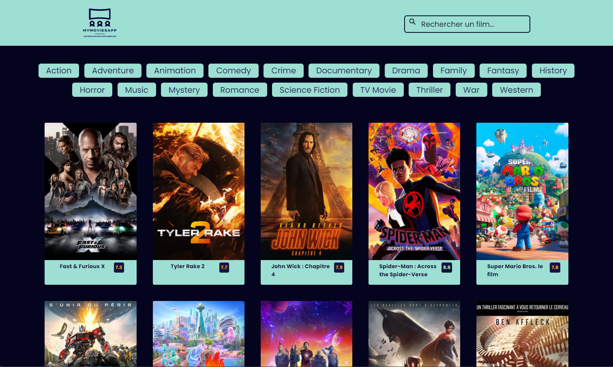
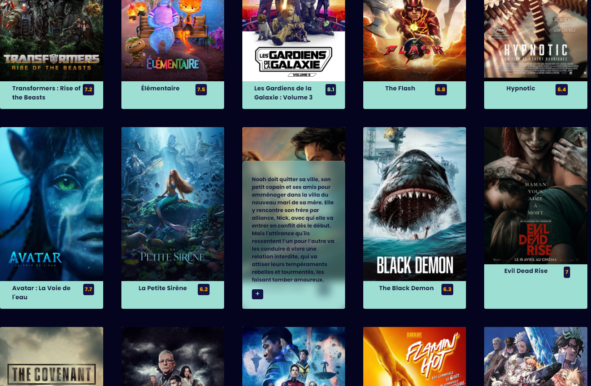

# MyMovieApp--TMDB-API--JavaScript
Création d'une application web en Javascript, utilisation de l'API de The Movies database

Projet réaliser intégralement en vanilla et le DOM pour la partie HTML :v:

by LuisMiLR 

